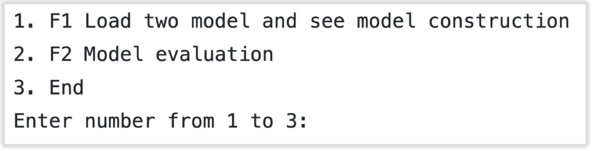
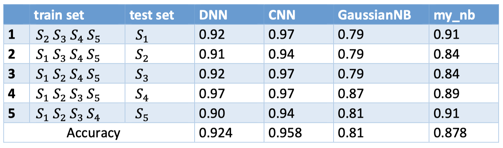
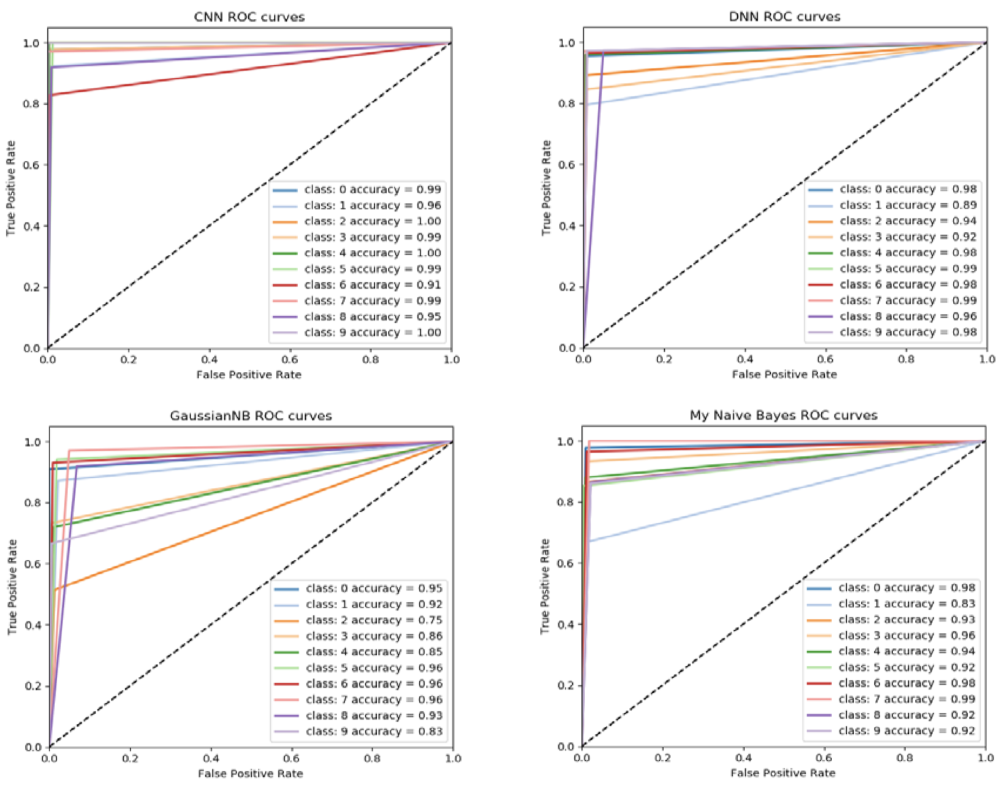
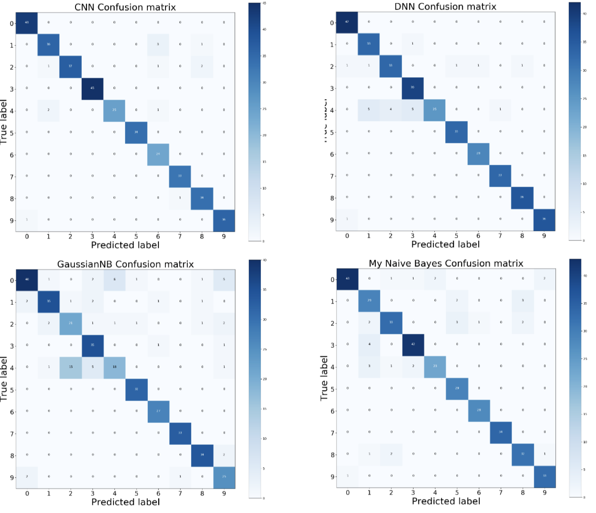

## 1. Detailing how to run your program, including the software dependencies

Software Dependencies:

- Python 3.8

- Numpy 1.19.5

- Scikit-learn 0.24.0

- Keras 2.4.3

- Tensorflow 2.4.0

- Matplotlib 3.3.3
 
**How to run program:**
Clone to your development environment and run main.py with python 3.7 interpreter: python main.py 

User interface of python program:	

The user selects numbers between 1 and 3 to run different implement, other numbers are not accepted.

##  2. Explaining how the functionalities and additional requirements are implemented

F1: Use `keras` framework as framework to design and build two different deep neural networks, one with convolutional layer and the other without convolutional layer. And save the model for loading.

F2: Model evaluation

### (a) The cross-validation of 5 subsamples

Manually divide five subsets in the given data set for cross validation. Calculate and output the accuracy (and loss rate) of each algorithm

### (b) Confusion matrix

First declare a 10*10 null array, iterate and loop through to determine if the predicted value and label are the same, if so, increment the position by 1, resulting in a 10*10 two-dimensional matrix confusion matrix. Then use `matplotlib.pyplot` to output the graph. These graphs are shown below.

### (c) ROC curve

Each predicted value and test dataset label are binarized and classified. Then use `roc_curve` and `auc` to calculate the ROC curve of the algorithm. Formula is

In the end, use `matplotlib.pyplot` to output the graph.

### (d) Discussion on the discovery

By comparing the results for Assessment 1 and Assessment 2. In the same dataset. ~Traditional machine learning~ takes the least time and does not require high performance but need to require more human resources to achieve ideal accuracy. ~Deep neural network~ only needs a simple setting to obtain a very ideal accuracy rate. However, the number of parameters in the neural network is very large, and many optimizers, such as RMSProp, SGD, ADAM, etc. are needed to find the local optimal solution. This algorithm is the most time-consuming and most dependent on computer performance.

The appropriate algorithm can be selected according to the requirements of the scene. Traditional machine learning is suitable for scenes with high realtime requirements and low data volume. Neural network is suitable for the scene with very large amount of data and high accuracy

## Providing the details of your implementation

### The meaning of parameters and variables

`all_x`: all the data from datasets all_y: all the target of each data from dataset 

`tra_x,tes_x,tra_y,tes_y`: Divide the datasets into train and test dataset 

`pre_y`: The predicted value(target) obtained by algorithm is used for comparison with `tes_y` 

`score`: The accuracy value (and loss value) for the model in test mode 

`model`: Model of the algorithm

### The description of your model evaluation

Two neural networks :

`def dnn():`

Create five layers by `keras.sequential`(show in Figure 1), two of which are Dropout to prevent overfitting.

Optimizer selects `RMSProp`, which is Gradient Descent.

Loss selects `categorical_crossentropy`, theexpression is (SEE PDF)

`def cnn():`

Create five layers by `keras.sequential`(show in Figure 2), the `Flatten` layer is used for the transition from the convolution layer to the full join layer, without affecting the batch size.

Optimizer select `Adam`, the parameters are

lr=0.01, beta_1=0.9, beta_2=0.999, epsilon=1e-08

Loss selects `categorical_crossentropy`.

In the end, these models will be saved, respectively are *CNNmodel.h5* and *DNN_model.h5* (`model.save`)

## Results of graph
**ROC cruve**

**Confusion matrix**
