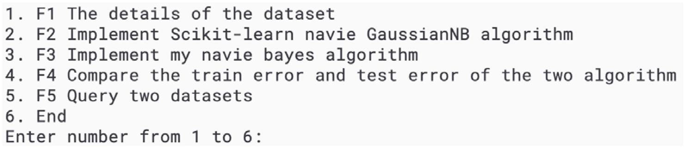
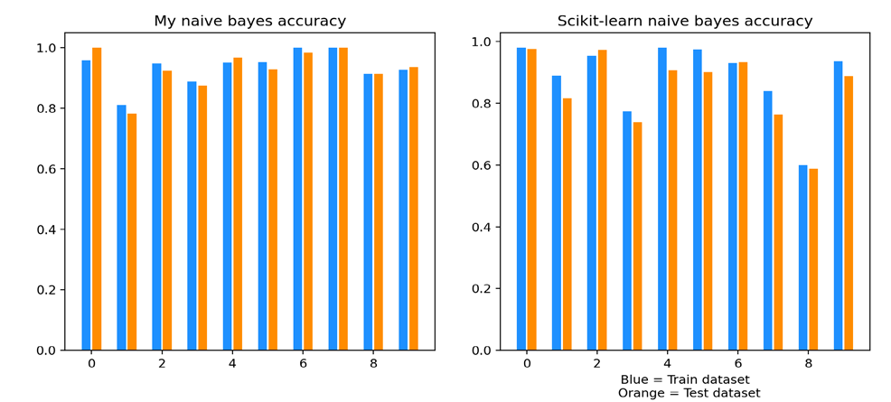

# COMP219-Advanced-Artificial-Intelligence


最近学人工智能(AI)，学到一些算法，攒积不少（摸鱼）经验。趁这次机会写篇文章给广大学者或者有兴趣的人。也是对自己的学习总结吧。后面抽空写个关于Decision, Compution and Language的文章（不知道为啥国内在这方面学习资料非常少）

Sklearn的手写字体的识别，本次用的是python3语言，会讲到的算法有四个，一个是自己写的贝叶斯算法(Naive bayes)，另一个直接调库。和神经网络的两个分别是DNN和CNN，本质上是有无convolutioal layer的区别。后面讲到算法的原理以及如何实现。过程中会用到交叉验证(cross validation), 混淆矩阵(confusion matrix) 和ROC曲线等方法来辅助理解。

由于篇幅限制，这里先介绍数据集以及用法和传统机器学习算法 朴素贝叶斯的原理以及实现方式

首先介绍一下本篇文章 所用的数据集是Scikit-learn的datasets，和MNIST数据集一样是用于入门学习的数据集。这里网站里有详细介绍数据集。


 [7.1. Toy datasets - scikit-learn 0.24.1 documentation](https://link.zhihu.com/?target=https%3A//scikit-learn.org/stable/datasets/toy_dataset.html%23optical-recognition-of-handwritten-digits-dataset) 


这里我们选择直接调库，也可以手动从网站中下载数据集


UCI Machine Learning Repository:  [Optical Recognition of Handwritten Digits Data Set](https://link.zhihu.com/?target=https%3A//archive.ics.uci.edu/ml/datasets/Optical%2BRecognition%2Bof%2BHandwritten%2BDigits) 

以下内容中文部分

[知乎](https://zhuanlan.zhihu.com/p/349754769)

# Naive bayes

## Introduction

**Dataset** : Optical recognition of handwritten digits dataset 

**Algorithm** : Naive bayes 

Since Naive bayes is a supervised, non-modeled classification algorithm, the implement f2 and f3 can be achieved by running the algorithm directly without save models.

## 1. Detailing how to run your program, including the software dependencies

Software Dependencies:

- Python 3.8

- Numpy 1.19.5

- Scikit-learn 0.24.0

- Keras 2.4.3

- Tensorflow 2.4.0

- Matplotlib 3.3.3
 
**How to run program:**
Clone to your development environment and run main.py with python 3.8 interpreter: python main.py
User interface of python program:		




The user selects numbers between 1 and 6 to run different implement, other numbers are not accepted.

2. Explaining how the functionalities and additional requirements are implemented
The dataset is loaded from the scikit-learn library and put into the matrix, and use `train_test_split function` to divide the dataset in to train dataset which is 30% and test dataset which is 70%

```
from sklearn import datasets
tra_x,tes_x,tra_y,tes_y = train_test_split(all_x,all_y,test_size=0.7)
```
****
```
def my_naive_bayes(x, y, mean, variance):
```
Transfer samples and labels of the dataset, mean and variance of the training set Bayes formula (SEE PDF)  is used to calculate the probability of sample vector of each digits

```
    for i in range(x.shape[0]):
        lists = []
        for j in range(len(classes)):
            numerator = np.exp(-((x[i] - mean[j]) ** 2) / (2 * variance[j]))
            denominator = np.sqrt(2 * np.pi * (variance[j]))
            prob_xc = numerator / denominator
            ratio = np.sum(np.log(prob_xc))
            lists.append(ratio)
        pred = lists.index(max(lists))

        if pred == y[i]:
            my_t_count = my_t_count + 1
            confusion_matrix[int(y[i])][int(y[i])] = confusion_matrix[int(y[i])][int(y[i])] + 1
```

`def f1(): ` Provide the details of the dataset Call the variable from the header: `all_x, all_y, a_x, tes_x, tra_y, tes_y`

Print the number of datasets:` all_x.shape[0], tra_x.shape[0], tes_x.shape[0]` 
Use a loop statement to calculate the number of each digits
Print the maximum and minimum values for each feature:
```
print(np.max(all_x, axis=0))
print(np.min(all_x, axis=0), '\n')
```

`def f2():`

Call scikit-learn library GaussianNB function/algorithm to process the datasets

```
from sklearn.naive_bayes import GaussianNB 
sk_nb = GaussianNB() 
sk_nb.fit(tem_tra_x, tem_tra_y) 
sk_nb_tra_y = (sk_nb.predict(tem_tra_x)) 
sk_nb_tes_y = (sk_nb.predict(tem_tes_x))
```

`def f3():`

Call the method `my_naive_bayes(x, y, mean, variance)` to compute the datasets Assign two matrixes to store the mean and variance of the train dataset 
```
for i in classes:
	tra_x_c = tra_x[tra_y == i]
	mean[int(i), :] = tra_x_c.mean(axis=0)
	variance[int(i), :] = tra_x_c.var(axis=0)
```

Use loop statements to filter samples for each category Assign two matrixes to store the mean and variance of the train dataset 
Call the method `my_naive_bayes(x, y, mean, variance)` to return the accuracy rate and number of train and test dataset respectively 
Return the correct rate for each digit, and the correct quantity counter


`def f4():`

Load and print the return values of both algorithms(My naive bayes algorithms and s scikit-learn GaussianNB algorithms) by call f2 and f3 function. And use matplotlib library to create a visualization




`def f5(): `Detect the input number and returns the aim image and the detail of data


**Additional requirements:**
Design interactive interface, users can directly run F1 – F6 programs by input instructions. Bar chart is used in the F5 program to visually compare the train dataset and test dataset accuracy under different algorithms.


## Providing the details of your implementation
### The idea of my algorithm

The naive bayes algorithm is used to classify the Optical recognition of handwritten digits dataset. The basic method is to calculate the probability that the current feature samples belong to a certain class based on statistical data and according to the conditional probability formula, and select the category with the highest probability Each picture of the handwritten digits’ dataset consists of 8*8 pixels, each pixel is represented by 0 - 16 gray level and has a label to indicate the class. Data is the array 1 * 64, which can be regarded as vector X Import the bayes formula (SEE PDF)


### The meaning of parameter and variable

 `all_x`: all the data from datasets	

 `all_y`: all the target of each data from dataset		

 `tra_x,tes_x,tra_y,tes_y`: Divide the datasets into train and test dataset  

 `sk_tra_digit_accuracy`: The digital accuracy of train dataset returned by scikit-learn GaussianNB algorithm 

 `sk_tra_true_count`: The correct number of train dataset returned by scikitlearn GaussianNB algorithm 

 `my_tes_digit_accuracy`: The digital accuracy of test dataset returned by my naive bayes algorithm 

 `my_tes_true_count`: The correct number of test dataset returned by my naive bayes algorithm 

`mean`: The mean of train dataset features classes

 `variance`: The variance of train dataset features classes
****


# Assignment2
## 1. Detailing how to run your program, including the software dependencies

Software Dependencies:

- Python 3.8

- Numpy 1.19.5

- Scikit-learn 0.24.0

- Keras 2.4.3

- Tensorflow 2.4.0

- Matplotlib 3.3.3
 
**How to run program:**
Clone to your development environment and run main.py with python 3.7 interpreter: python main.py 

User interface of python program:	


The user selects numbers between 1 and 3 to run different implement, other numbers are not accepted.

##  2. Explaining how the functionalities and additional requirements are implemented

F1: Use `keras` framework as framework to design and build two different deep neural networks, one with convolutional layer and the other without convolutional layer. And save the model for loading.

F2: Model evaluation

### (a) The cross-validation of 5 subsamples

Manually divide five subsets in the given data set for cross validation. Calculate and output the accuracy (and loss rate) of each algorithm

### (b) Confusion matrix

First declare a 10*10 null array, iterate and loop through to determine if the predicted value and label are the same, if so, increment the position by 1, resulting in a 10*10 two-dimensional matrix confusion matrix. Then use `matplotlib.pyplot` to output the graph. These graphs are shown below.

### (c) ROC curve

Each predicted value and test dataset label are binarized and classified. Then use `roc_curve` and `auc` to calculate the ROC curve of the algorithm. Formula is

In the end, use `matplotlib.pyplot` to output the graph.

### (d) Discussion on the discovery

By comparing the results for Assessment 1 and Assessment 2. In the same dataset. ~Traditional machine learning~ takes the least time and does not require high performance but need to require more human resources to achieve ideal accuracy. ~Deep neural network~ only needs a simple setting to obtain a very ideal accuracy rate. However, the number of parameters in the neural network is very large, and many optimizers, such as RMSProp, SGD, ADAM, etc. are needed to find the local optimal solution. This algorithm is the most time-consuming and most dependent on computer performance.

The appropriate algorithm can be selected according to the requirements of the scene. Traditional machine learning is suitable for scenes with high realtime requirements and low data volume. Neural network is suitable for the scene with very large amount of data and high accuracy

## Providing the details of your implementation

### The meaning of parameters and variables

`all_x`: all the data from datasets all_y: all the target of each data from dataset 

`tra_x,tes_x,tra_y,tes_y`: Divide the datasets into train and test dataset 

`pre_y`: The predicted value(target) obtained by algorithm is used for comparison with `tes_y` 

`score`: The accuracy value (and loss value) for the model in test mode 

`model`: Model of the algorithm

### The description of your model evaluation

Two neural networks :

`def dnn():`

Create five layers by `keras.sequential`(show in Figure 1), two of which are Dropout to prevent overfitting.

Optimizer selects `RMSProp`, which is Gradient Descent.

Loss selects `categorical_crossentropy`, theexpression is (SEE PDF)

`def cnn():`

Create five layers by `keras.sequential`(show in Figure 2), the `Flatten` layer is used for the transition from the convolution layer to the full join layer, without affecting the batch size.

Optimizer select `Adam`, the parameters are

lr=0.01, beta_1=0.9, beta_2=0.999, epsilon=1e-08

Loss selects `categorical_crossentropy`.

In the end, these models will be saved, respectively are *CNNmodel.h5* and *DNN_model.h5* (`model.save`)


## Results of graph
**ROC cruve**


**Confusion matrix**
